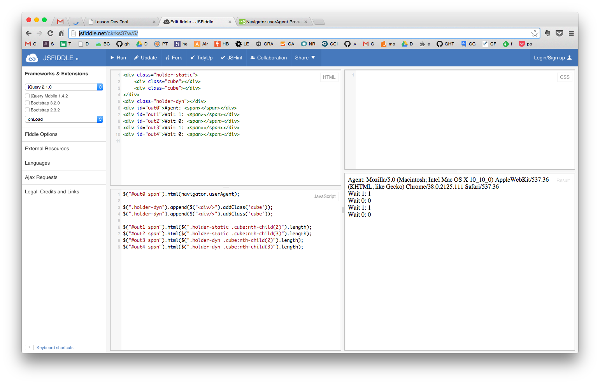
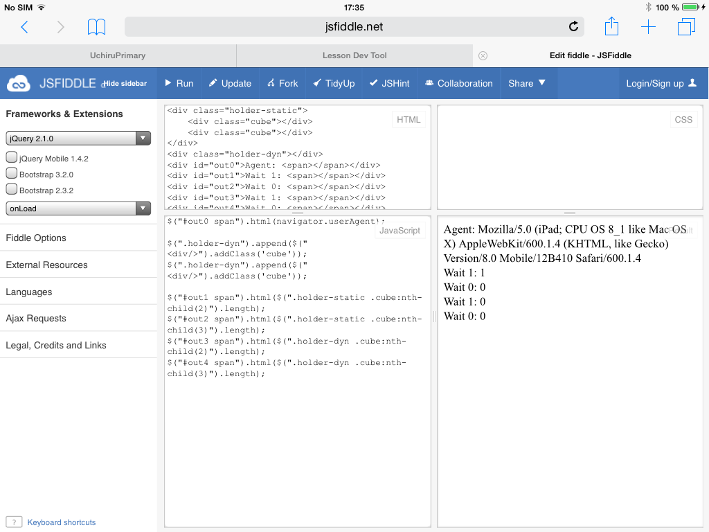
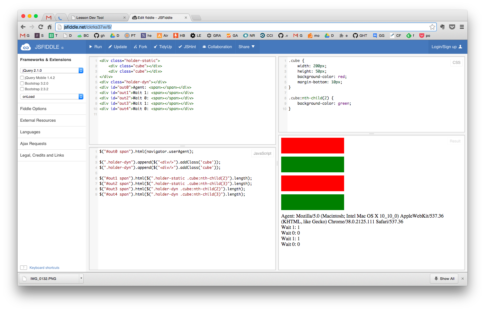
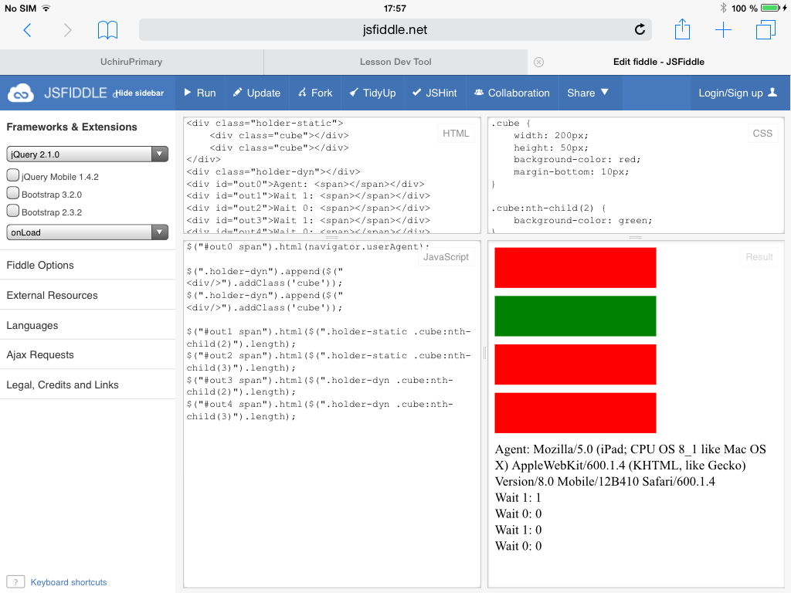

# CoffeeScript Code Style Guide

## Оглавление

* [Цель написания руководства](#Цель-написания-руководства)
* [Структура контента uchi.ru](#Структура-контента-uchiru)
  * [Основные понятия](#Основные-понятия)
    * [Топик](#Топик)
    * [Карточка](#Карточка)
    * [Чанк](#Чанк)
    * [Скрипт](#Скрипт)
    * [Сцена](#Сцена)
    * [Шаг](#Шаг)
    * [Значение генерации](#Значение-генерации)
    * [Стратегия](#Стратегия)
    * [SBS](#sbs)
  * [Пути файлов](#Пути-файлов)
  * [Файлы для карточки](#Файлы-для-карточки)
  * [Краткий алгоритм создания новой карточки](#Краткий-алгоритм-создания-новой-карточки)
  * [Рыба карточки](#Рыба-карточки)
* [Правила написания css файлов](#Правила-написания-css-файлов)
  * [Уровни вложенности](#Уровни-вложенности)
* [Правила написания js.coffee файлов](#Правила-написания-jscoffee-файлов)
  * [Отступы и табуляция](#Отступы-и-табуляция)
  * [Пробелы](#Пробелы)
  * [Пустые строки](#Пустые-строки)
  * [Максимальная длина строки символов](#Максимальная-длина-строки-символов)
  * [Правила именования переменных, методов, функций](#Правила-именования-переменных-методов-функций)
  * [Стиль именования переменных, методов, функций](#Стиль-именования-переменных-методов-функций)
  * [Комментарии](#Комментарии)
* [Особенности программирования контента uchi.ru](#Особенности-программирования-контента-uchiru)
  * [Особенности написания шагов](#Особенности-написания-шагов)
  * [Особенности написания вспомогательных методов](#Особенности-написания-вспомогательных-методов)
  * [Особенности составления генераций](#Особенности-составления-генераций)
  * [Примеры работы с @tutor](#Примеры-работы-с-tutor)
    * [`t`](#t)
    * [`event`](#event)
    * [`wrong`](#wrong)
    * [`the_end`](#the_end)
  * [Задержки (delay)](#Задержки-delay)
  * [Поиск по DOM дереву](#Поиск-по-dom-дереву)
  * [Promises](#promises)
  * [CSS стили в JS файле](#css-стили-в-js-файле)
  * [Именование хинтов, инпутов и прочих компонентов в карточке](#Именование-хинтов-инпутов-и-прочих-компонентов-в-карточке)
  * [Нерекомендуемые элементы (найдены баги на некоторых браузерах, т.д.)](#Нерекомендуемые-элементы-найдены-баги-на-некоторых-браузерах-тд)
* [Список литературы](#Список-литературы)


## Цель написания руководства

[to top](#coffeescript-code-style-guide)

Целью написания служит стремление добиться единобразности, понятности и в целом красоты кода. Когда предполагается, что кодом будут пользоваться другие люди, необходимо писать так, чтобы другие могли быстро разобраться, как работает тот или иной кусок.

Как известно, читать код гораздо сложнее, чем его писать. Но еще сложнее писать код так, чтобы его можно было легко читать.

## Структура контента uchi.ru

[to top](#coffeescript-code-style-guide)

### Основные понятия

[to top](#coffeescript-code-style-guide)

Здесь кратко введем основные понятия. Подробнее о них будет написано на протяжении всей статьи.

#### Топик

Топик (от англ. *topic*) - тема задач. Например t08 - плюс-минус 1-100 - отработка счета чисел от 1 до 100. В рамках этого топика существуют отдельные карточки, например сложение методом ближайшего круглого числа, сложение-вычитание с переходом и др. Нужны для лучшей структурированности и логической связности контента.

#### Карточка

Карточка - это индивидуальная самостоятельная единица контента. Карточка может считаться отдельным небольшим модулем, в котором есть входные данные (значения генерации) и свои под-модули (чанки). В карточке (интерактивном уроке) отрабатывается одна задача на одну тему.

Карточка в cms имеет свой уникальный идентификатор, например карточка 710. Каждая карточка относится только к одному топику.

#### Чанк

Чанк (от англ. *chunk*) - отдельная часть карточки. Карточка может состоять из 1 чанка, а может состоять из 4 (и более) чанков. В одном чанке может реализовываться новый способ решения задачи, отсутствуют подсказки, некоторые инпуты и т.д., отрабатываться новые генерации и т.п.

Например, карточка 687 - сложение числа с помощью кубиков.

- Чанк 2 - основная логика задачи - модель шкафа, примеры на сцене, летят палки, и т.д.

- Чанк 1 - сначала появляется анимация, потом появляется инпут у примера и превращается в ?

- Чанк 3 - все точно так же, но без хинтов(например, для того, чтобы ребенок на чанке 1 уже научился решать примеры, а на чанке 2 просто набивал руку).

- Чанк 4 - добавляется пример с переменой мест слагаемых, а модель на сцене уже находится и от примеров не зависит (т.е. отработка момента, что от перемены мест слагаемых сумма не меняется).

Чанки, как видно из примера, могут быть почти идентичны, а могут и кардинально отличаться.

Для каждого чанка создается **отдельный** скрипт и файл стилей.

Если чанки идентичны и отличаются только набором генераций, то допустимо оставить один скрипт.

#### Скрипт

Скрипт - это основной файл карточки, файл с расширением .js.coffee.

В скрипте описывается логика всей карточки или логика одного чанка.

Скрипты подключаются в json файле.

#### Сцена

Сцена - это место для проигрывания карточки. К ней прицепляются все остальные элементы.

Способ обращения: `@place`.

#### Шаг

Шаг - длительное законченное действие (анимация, прослушка инпута, драг и др.). По сути, это метод, который называется `step<номер шага>`. Могут быть вариации вида `step0_0`, `step1_2` и др.

#### Значение генерации

Значение генерации или просто генерация - это как входные данные для приложения. Они описываются в json файле карточки, для каждого чанка и могут быть довольно большие.

Генерации составляют педагоги и записывают в doc файл, и оставляют в dropbox папке карточки.

Для тестирования можно использовать генерацию(и), которые даны в бумажном прототипе будущей карточки.

Генерации описываются в json файле карточки и имеют свои тонкости, о которых упомянуто далее в статье.

#### Стратегия

Стратегия - способ выбора генераций карточки. Основная стратегия `stack` (которая вопреки названию больше напоминает кольцевую очередь); есть еще `stack_adaptive` (пример, на котором ребенок ошибся, "подмешивается" еще раз через некоторое время для закрепления).

Эти способы нужны для того, чтобы по определенному алгоритму выдавать ребенку новые примеры. Например, если ребенок обновит страницу и начнет выполнять заново и будет ошибаться на определенных примерах, в разные моменты времени ему будут для закрепления выдаваться разные примеры.

#### SBS

SBS шаги (от англ. *Step By Step*) - сущность, нужная для статистики, которую могут видеть педагоги. Например, отслеживание правильных и неправильных ответов ребенка, осуществления каких-либо действий (произошел драг кубика, анимация палок, вытаскивание яблока из ящика и др.)

В карточке есть всегда. В некоторых методах зашиты стандартные наименования некоторых SBS шагов (например в методе `input_answer_wait` зашит SBS `input_char_wrong`, `input_char`, `input_finish`).

### Пути файлов

[to top](#coffeescript-code-style-guide)

Отдельно стоит сказать про пути файлов. Краткая структура проекта content:

```
content/
├── cards/ # json файлы карточек
├── components/ # папка компонентов (основной плеер, кнопки, инпуты, хинты и пр.)
└── src/ # основная папка разработчика контента
    └── primary_school/ # карточки для начальной школы
        ├── assets/ # изображения для карточек (при необходимости)
        ├── t01.num_1_10/ # первый топик
        │   └── card_test/ # папка для карточки в первом топике
        │       ├── scriptID_script.json # json скрипта
        │       ├── script_scriptID.js.coffee # скрипт
        │       └── script_scriptID.css.scss # файл стилей скрипта
        ├── t02/
        # и так далее по увеличению топиков
```

Таким образом, перед созданием карточки мы узнаем у Дарии имя топика и номер карточки, у cms номер скрипта и создаем руками все нужные нам файлы.

### Файлы для карточки

[to top](#coffeescript-code-style-guide)

Один интерактивный урок (карточка) состоит из 4 основных файлов:

#### `cardID_card.json`

Где `cardID` - это уникальный идентификатор карточки.

`cardID` заводит методист, и самостоятельно его резервировать не нужно.

В этом файле описывается имя карточки, чанки, генерации, ссылки на скрипты по чанкам и др.

Пример файла:

```js
// 687_card.json
{
  "name_ru": "Прибавляем круглое число с помощью кубиков", // Имя карточки
  "progress": "beads",  // Прогресс измеряется в бусинах
  // Подключение компонентов. Здесь только один обязательный.
  "require": [
    "/components/_player_v1"
  ],
  // Описание структуры каждого чанка
  // Чанк 1
  "chunks": [
    {
      // Скрипт в котором реализована логика чанка
      "script": 343,
      // Количество бусин (указывается в прототипе карточки или узнается у Дарии)
      "amount": 1,
      // Стратегия выбора генераций, в основном всегда stack
      "strategy": "stack",
      // Описание генераций
      "generations": [
        {
          "task": "35+40"
        },
        {
          "task": "47+20"
        },
        {
          "task": "23+50"
        }
      ]
    },
    // Чанк 2
    {
      "script": 352,
      "amount": 3,
      "strategy": "stack",
      "generations": [
        {
          "task": "62+30"
        },
        {
          "task": "18+60"
        },
        {
          "task": "24+40"
        },
        {
          "task": "43+20"
        },
        {
          "task": "55+30"
        },
        {
          "task": "31+50"
        }
      ]
    }
  ]
}
```

#### `scriptID_script.json`

Где `scriptID` - это уникальный идентификатор скрипта, который присваивается в cms
во вкладке **"Scripts" -> "New Script"**.

В этом файле описываются параметры скрипта, ссылки на необходимые стили скрипта и компоненты, а также
текстовые контанты (имена хинтов, текстовые сообщения и др.)

**Имя файла может быть только таким как в образце**.

Пример файла:

```js
// к примеру, scriptID = 378
// 378_script.json
{
  // Имя скрипта
  "name": "two-digit_plus-minus_one-digit_similar_examples",
  // Подключение обязательных компонентов и собственно файлов скрипта и стилей
  "require": [
    "/components/kernel",
    "/components/input",
    "/components/simple_parser",
    "/components/hint",
    "/components/button",
    "script_378.css",
    "script_378.js"
  ],
  // Описание некоторых языковых констант (текст на кнопках, хинтах и т. п.)
  "lang": {
    "ru": {
      "question_notify": "Давай решать вместе<br>методом ближайшего<br>круглого числа",
      "already_did_this_example": "Похожий пример<br>ты уже решал",
      "already_did_these_examples": "Похожие примеры<br>ты уже решал"
    },
    // Английские константы самостоятельно не нужно заполнять
    "en": {
    }
  }
}
```

#### `script_scriptID.js.coffee`

Coffee файл скрипта, который компилируется на выходе в javascript файл.

Здесь описывается основная логика карточки (или одного из чанков карточки).

**Имя файла скрипта может быть любым**. Приведенный выше образец - лишь пример.

Примерная структура js.coffee файла может выглядеть так:

```coffeescript
# Например, scriptID = 378
# Определяется класс скрипта
class $$.Script378

  # SBS шаги
  @SBS:
    start: "[start]"

  # Основной конструктор
  # @place - основная сцена, т.е. div, в котором происходит основное действие
  # (визуальная часть карточки)
  # @tutor - объект описанный в API к системе; отвечает за события
  constructor: (@place, @tutor) ->

  # @salt -переменная генераций
  run: (@salt) ->

  # Исходные данные, получение данных из генераций

  # Некоторые расчеты переменных, вызов специальных для этого методов,
  # Формирование основных переменных для использования их в отображении

  # Отображение (визуальная часть)
  # Добавление основных элементов на сцену

  # Вызов какого-нибудь первого значимого шага и дальнейшая логика карточки
  @step0()


  step0: ->
    # код шага
    @step1()


  step1: ->
    # код шага
    @step2(some_param)


  step2: (param) ->
    #  код шага
    # пока в карточке ничего не происходит, завершение урока например здесь
    @tutor.the_end()

```

Пример файла:

```coffeescript
# например, scriptID = 343
# script_343.js.coffee
class $$.Script343
  @SBS:
    start: "[start] Пример: %example%"
    input_char: "Введена правильная цифра <green>%value%</green>"
    input_char_wrong: "Введена неправильная цифра <red>%value%</red>"
    input_finish: "<green>Пример решен верно</green>"
    brick_animation: "Анимация розовых палок"

  constructor: (@place, @tutor) ->

  run: (@salt) ->
    @tutor.event('start', example: @salt.task)

    # Исходные данные
    [@a, @sign, @b] = $$.simple_parse(@salt.task)

    @a_tens = Math.floor(@a / 10)
    @a_units = @a % 10
    @b_tens = Math.floor(@b / 10)
    # Общее количество палок на сцене
    @r_tens = Math.floor($$.simple_calc(@salt.task) / 10)

    @sign = $$.typograph(@sign)

    @scene = $.div().addClass('scene').appendTo(@place)
    @area_container = $.div().addClass('area-container').appendTo(@scene)

    # Шкаф с палками
    @area_tens = $.div().addClass('area-tens').appendTo(@area_container)
    $.div().html(@tutor.t('tens')).addClass('text').appendTo(@area_tens)

    # Шкаф с кубиками
    @area_units = $.div().addClass('area-units').appendTo(@area_container)
    $.div().html(@tutor.t('units')).addClass('text').appendTo(@area_units)
    # Подсветка для шкафа с кубиками
    @area_units_hl = $.div().addClass('area-units area-units-hl').appendTo(@area_units).hide()

    # Добавить подсветку палок
    for i in [0...@r_tens]
      $.div().addClass('brick-hl blue').appendTo(@area_tens).css(left: @_calc_left_pos_brick(i) - 16).hide()

    # Добавить голубые палки
    for i in [0...@a_tens]
      $.div().addClass('brick blue').appendTo(@area_tens).css(left: @_calc_left_pos_brick(i))

    # Добавить розовые палки
    for i in [@a_tens...@r_tens]
      # Розовые палки убраны за сцену (потребуется для анимации)
      $.div().addClass('brick pink').appendTo(@area_tens).css(left: @_calc_left_pos_brick(i), top: -330)

    # Добавить подсветку для кубиков
    for i in [0...@a_units]
      $.div().addClass('cube-hl').appendTo(@area_units).css(top: @_calc_top_pos_cube(i) - 20).hide()

    # Добавить кубики в шкаф
    for i in [0...@a_units]
      $.div().addClass('cube cube-blue').appendTo(@area_units).css(top: @_calc_top_pos_cube(i))

    # Контейнер для задачи
    @input_holder = $.div().addClass('input-holder').prependTo(@area_container)

    # Добавляем первое число
    @input_a = $$.input('input', digits: 2, value: @a, state: 'blank').appendTo(@input_holder)

    # Добавляем знак операции
    $.span().addClass('sign').html(@sign).appendTo(@input_holder)

    # Добавляем второе число
    @input_b = $$.input('input', digits: 2, value: @b, state: 'blank').appendTo(@input_holder)

    # Добавляем =
    $.span().addClass('equals').html('=').appendTo(@input_holder)

    # Добавляем результирующий инпут
    @input_result = $$.input('input input-result', state: 'blank', digits: 2, value: '?').appendTo(@input_holder)

    #  Хинт "посмотри сколько палок"
    @hint_look_how_many_bricks = $$.hint('hint-yellow', @tutor.t('look_how_many_bricks')).appendTo(@area_tens)
    $$.hint_point(@hint_look_how_many_bricks, @_calc_blue_brick_left_offset(), @area_tens.outerHeight(), direction: 'bottom')
    @hint_look_how_many_bricks.hide()

    # Желтый хинт "посмотри сколько кубиков" - ставим хинт на середину общего кол-ва кубиков
    @hint_look_how_many_cubes = $$.hint('hint-yellow', @tutor.t('look_how_many_cubes')).appendTo(@area_units)
    $$.hint_point(@hint_look_how_many_cubes, @area_units.outerWidth(), @_calc_blue_cubes_hl_top_offset(), direction: 'right')
    @hint_look_how_many_cubes.hide()

    @step1()


  step1: ->
    # Анимация и превращение ? в инпут
    $.delay 1500, =>
      @scene.find('.area-tens').addClass('highlighted')

    $.delay 2500, =>
      @tutor.event('brick_animation')
      @area_tens.find('.brick.pink').animate({top: 40}, 800).promise().done =>
        @scene.find('.area-tens').removeClass('highlighted')
        $$.input_set_state(@input_result, 'focused')
        $$.input_set_value(@input_result, '')
        @step2()


  step2: ->
    # Обработка клавиатурных нажатий результирующего инпута
    $$.input_answer_wait @input_result, @tutor, $$.simple_calc(@salt.task), {}, (hash) =>
      if hash.status == 'wrong' && hash.correct.length == 0
        # Показать подсветку всех палок и хинт
        @place.find('.brick-hl.blue').show()
        @hint_look_how_many_bricks.show()

      else if hash.status == 'right' && hash.correct.length > 0
        # Убрать подсветку всех палок и хинт
        @place.find('.brick-hl.blue').hide()
        @hint_look_how_many_bricks.hide()

      else if hash.status == 'wrong' && hash.correct.length > 0
        # Показать подсветку кубиков и хинт
        @place.find('.cube-hl').show()
        @hint_look_how_many_cubes.show()

      if hash.status == 'completed'
        # Убрать подсветку кубиков и хинт
        @place.find('.cube-hl').hide()
        @hint_look_how_many_cubes.hide()
        @tutor.the_end()


  # Вычисление отступов между кубиками
  _calc_top_pos_cube: (index) ->
    front_brick_width = 25 # ширина фронтальной части кубика в пикселях
    front_brick_width * (9 - index) + 51


  # Вычисление отступов между палками
  _calc_left_pos_brick: (index) ->
    front_brick_width = 25 # ширина фронтальной части палки в пикселях
    if index >= 5
      gap = 16
    else
      gap = 0
    front_brick_width*index + 33 + gap


  # Вычисляем величину, на которую сдвигаем хинт на середину голубых палок
  _calc_blue_brick_left_offset: ->
    @place.find('.brick')[Math.floor(@r_tens / 2)].offsetLeft


  # Вычислим величину, на которую сдвинем хинт к середине подсветке кубиков
  _calc_blue_cubes_hl_top_offset: ->
    @place.find('.cube-hl').show()
    blue_cubes_hl_top_offset = @place.find('.cube-hl')[Math.floor((@a_units - 1) / 2)].offsetTop
    @place.find('.cube-hl').hide()
    blue_cubes_hl_top_offset

```

#### `script_scriptID.css.scss`

Scss файл стилей скрипта, который компилируется на выходе в css файл.

Здесь описываются основные стили скрипта, подключение примесей необходимых компонентов.

**Имя файла скрипта может быть любым**. Приведенный выше образец - лишь пример.

Пример файла:

```scss
// Обязательное описание всех стилей в пространстве `&`
& {
  // Подключение каких-нибудь примесей
  @include inline_input('input', 45px);
  @include hint('hint-white',$kind: 'white');
  @include hint('hint-yellow');

  // Шкаф для палок
  .area-tens {
    border-radius: 10px;
    padding: 10px;
    background: #ececec;
    position: relative;
    margin-right: 20px;
    width: 303px;
    height: 301px;
    display: inline-block;
    left: -66px;
    z-index: -1;
    &.highlighted {
      background: #fff4dc;
    }
  }

  // Шкаф для кубиков
  .area-units {
    border-radius: 10px;
    padding: 10px;
    background: #ececec;
    position: relative;
    width: 76px;
    height: 301px;
    display: inline-block;
    left: -76px;
  }
}
```

### Краткий алгоритм создания новой карточки

[to top](#coffeescript-code-style-guide)

1. cms -> Cards -> Находим карточку с нужным номером

2. Узнаем в каком топике находится карточка

3. Находим папку топика (папка топика на английском языке) в папке проекта content, открытого в вашей IDE

4. Создаем в папке топика папку карточки на английском языке (подробнее о путях - **Пути файлов**, о имени папки - **Стиль именования переменных, методов, функций**)

5. cms -> Scripts -> New Script

6. Запоминаем номер созданного скрипта

7. В папке /путь/до/проекта/content/Cards создаем файл **cardID_card.json**, cardID - номер карточки

8. В папке топик/папка_карточки создаем 3 файла: **scriptID_script.json**, **script_scriptID.css.scss** и **script_scriptID.js.coffee**

### Рыба карточки

[to top](#coffeescript-code-style-guide)

Здесь приведена рыба карточки, самая минимальная и рабочая. В дальнейшем она расширяется.

Например, гипотетическая карточка 666 состоит из 1 чанка и 1 скрипта и 1 файла стилей, номер скрипта 999:

#### `999_script.json`

```json
{
  "name": "card_name",
  "require": [
    "/components/kernel",
    "script_999.css",
    "script_999.js"
  ],
  "lang": {
    "ru": {
    },
    "en": {
    }
  }
}
```

#### `script_999.js.coffee`

```coffeescript
class $$.Script999

  @SBS:
    start: '[start]'

  constructor: (@place, @tutor) ->

  run: (@salt) ->

    @tutor.the_end()
```

#### `script_999.css.scss`

``` scss
& {
}
```

#### `666_card.json`

```json
{
  "name_ru": "Название карточки на русском языке как она названа в cms",
  "progress": "beads",
  "require": [
    "/components/_player_v1"
  ],
  "chunks": [
     {
        "script": 999,
        "amount": 1,
        "strategy": "stack",
        "generations": [
          {
          }
        ]
     }
  ]
}
```

## Правила написания css файлов

[to top](#coffeescript-code-style-guide)

Весь файл "оборачивается в пространство `&`, и пустой css.scss файл имеет вид:

```scss
& {
  // Здесь все остальные стили
}
```

### Уровни вложенности

[to top](#coffeescript-code-style-guide)

Уровней вложенности должно быть 1-2. Слишком большие уровни увеличивают поиск нужного элемента и ухудшают читаемость кода.

Примеси подключаются вверху.

Стили пишутся "полосами", т.е. смысловые блоки стилей отделяются друг от друга пустой строкой и добавляется комментарий. Стили внутри смыслового блока пишутся без пустой строки.

Отступы в файле в 2 пробела.

Примеры смысловых блоков:

```scss
& {
  // Шкаф для кубиков
  .area-units {
    border-radius: 10px;
    padding: 10px;
    background: #ececec;
    position: relative;
    width: 76px;
    height: 301px;
    display: inline-block;
    left: -76px;
  }
  .area-units-hl {
    top: -6px;
    left: -8px;
    width: 92px;
    height: 313px;
    z-index: -1;
    background: #FFCA00;
    position: absolute;
    display: inline-block;
  }

  // Заголовки к шкафам
  .text {
    font-size: 18px;
    line-height: 18px;
  }
}
```

Имена селекторов пишутся в нижнем регистре, разделяя каждое смысловое слово символом `_` или `-`. Пример:

```scss
.bricks {
}

.brace-round-hint {
}

.area-units {
}
```

Желательно выбрать один раз стиль символа разделителя в имени селектора и использовать во всем файле для повышения единообразности.

Имена селекторов должны хорошо отражать суть элемента, стиль к которому селекторы применяют. Особенно это касается подсветок различных элементов.

Имена подсветок могут быть например `bricks-blue-hl`, `cubes-hl`, `bird_brow_highlight` и т.д. Допускается связка вида:

```scss
.brick {
  ...
  &.hl {
    ...
  }
}
```

В примере выше не забывать о том, что уровней вложенности не более 2.

Не использовать имя одного и того же селектора в разных смысловых блоках и с большим уровнем вложенности. Например:

```scss
.some-component {
    // стили
    &.span:first>hl {
        &.hl {
            // стили
            ...
            &.some-c {
                &.hl {
                    ...
                }
              ...
            }
        }
    }
}
```

В целом код должен легко "пролистываться" глазами, прерываясь перед следующей полосой смыслового блока и продолжаясь вновь.

В конце файла проставление пустой строки - не обязательно и не запрещается.

## Правила написания js.coffee файлов

[to top](#coffeescript-code-style-guide)

Код должен быть с минимальным уровнем вложенности, понятным, лаконичным, легко читаемым и поддерживаемым.

### Отступы и табуляция

[to top](#coffeescript-code-style-guide)

Отступ равен 2 пробелам.

Важно отметить, что правило "отступ в 2 пробела" относится не только к js.coffee файлам, но и к css.scss и json файлам.

### Пробелы

[to top](#coffeescript-code-style-guide)

Пробелы ставятся в случаях:

- операции присвоения (`=`, `+=`,...), логические операции (`&&`, `||`), операции сравнения (`==`, `!=`), операции отношений
(`<`, `>`, `<=`, `>=`), побитовые операторы (`&`, `|`, `^`), арифметические операции (`+`, `-`), операторы сдвига (`<<`, `>>`, `>>>`)

- после запятой, после оператора `:`

  ```coffeescript
  a += 3
  i == j || j > 5
  mas = [1, 2, 3, 4]
  ```

Пробелы **не ставятся** в случаях:

- мультипликативные операции (`*`, `/`, `%`)

- унарные операторы (`++`, `--`)

- перед запятой, перед оператором `:`

  ```coffeescript
  (a + b)/2
  i--
  obj = {a: 2}
  mas = [1, 2, 3, 4]
  ```

### Пустые строки

[to top](#coffeescript-code-style-guide)

Любая функция или метод (шаг, вспомогательный метод) отделяются 2 пустыми строками до и после

Внутри метода смысловые блоки допустимо отделять 1 пустой строкой.

При объемном операторе `if-else` каждое условие допустимо отделить 1 пустой строкой.

### Максимальная длина строки символов

[to top](#coffeescript-code-style-guide)

Максимальную длину желательно установить как 120 символов.

### Правила именования переменных, методов, функций

[to top](#coffeescript-code-style-guide)

На тему именования переменных, методов, функций говорилось уже очень много, но от этого значение этой проблемы все равно не переоценимо.

Основные моменты:

1. Основной принцип - имя должно полно и точно описывать сущность, представляемую переменной. (Макконелл, стр. 253)

2. Хорошее мнемоническое имя описывает проблему, а не ее решение. Хорошее имя в большей степени выражает *что*, а не *как*.
Например, сведения о сотруднике можно назвать *input_rec* или *employee_data*. Первое - из области компьютеров и
относится например к базам данных, второе - точно подходит проблемной области. (Макконелл, стр. 254)

3. Разумно выбирать длину имени.

4. Имена методов начинать с глагола.

5. Аргументы метода должны быть названы и расположены в методе интуитивно понятно, чтобы легко запомнить сигнатуру метода.

6. Имена пишутся не транслитом, а словами из английского языка.

Например:

```coffeescript
# No
korzina_razmer
conteiner
listner
# Yes
basket_size
container
listener
```

### Стиль именования переменных, методов, функций

[to top](#coffeescript-code-style-guide)

Используем стиль как у С, ruby: латинские символы в нижнем регистре, разделенные символом `_`. Например:

`get_state`, `_calc_cubes_left_offset`, `brick_size`, `cube_color`.

### Комментарии

[to top](#coffeescript-code-style-guide)

Комментарии использовать рационально, по необходимости и писать понятно и доходчиво.

Собственный метод, выполняющий сложную логику, документировать сверху блоком комментария и возможные проблемные для понимания места в самом методе. Пример:

```coffeescript
# Лопнуть палки по очереди
_blow_bricks: (i, brick_array, callback) ->
  blow = $.div().appendTo(brick_array.get(i))
  @_blow_brick(brick_array.get(i), blow, 0, =>
    blow.remove()
    $.delay 200, =>
      # если палка последняя
      if i == 0
        callback()
      else
        @_blow_bricks(i - 1, brick_array, callback)
  )
```

Текст комментария отделяется от `#` пробелом и текст пишется с большой буквы. Если комментарий внутри метода, то допустимо писать с маленькой буквы.

## Особенности программирования контента uchi.ru

[to top](#coffeescript-code-style-guide)

**Скрипт** состоит из шагов, **run** - отрисовка, **шаг** - обычно длительное законченное действие (инпут, анимация, драг).

Методы определяем в конце скрипта, перед ними определяем сами шаги.

Избегать большой вложенности скрипта (разбивать на шаги или выносить в методы).

Отделять логику от отображения; не мешать вычисления с созданием DOM структуры на странице - выделять в методы и вызывать
при создании элементов при необходимости.

### Особенности написания шагов

[to top](#coffeescript-code-style-guide)

Во шагах используем `->`.

**Шаг** - это длительные законченные действия (анимация, прослушка инпутов, кнопок, драг, и т.д.).

Все остальное мелкое, но повторяющееся выносить в методы.

### Особенности написания вспомогательных методов

[to top](#coffeescript-code-style-guide)

Во вспомогательных методах используем `=>`.

Из методов шаги не вызывать, только callbacks.

В метод выносить повторяющиеся действия, вызываемые более 1 раза, сложные расчеты и т.д.
Например, сложные подсветки элементов при ошибках, математические вычисления длин-отступов элементов.

Имена методов осмысленные, начинаются с `_`. Например `_calc_brace_left_offset`, `_highlight_cubes_if_error` и т.д.

### Особенности составления генераций

[to top](#coffeescript-code-style-guide)

Основной принцип - генерации должны быть минимальны и функционально полные (конъюнкция, дизьюнкция и отрицание как пример функционально полного логического базиса). Все остальное может быть высчитано в скрипте.

Пример 1 - Карточка 709.

```json
"generations": [
  {
    "items": [
      "60+7+20+4",
      "60+3+20+4",
      "60+3-20+4"
    ],
    "task": "63+24"
  }
]
```

Пример 2 - Карточка 687.
  
```json
"generations": [
  {
    "task": "35+40"
  }
]
```

Строку можно распарсить и получить результат вычисления, первую цифру первого слагаемого и т.д.

### Примеры работы с `@tutor`

[to top](#coffeescript-code-style-guide)

*Tutor* - объект из API к системе, отвечает за различные события и составление SBS репортов.

Описан в `/components/_player_v1/tutor.js.coffee`

С помощью него можно вызывать события:

#### `t`

`t` (от англ. *translate*) - еобходимо, если нужно взять значение некой константы на русском или английском языках.

Константа описывается в json файле, и указав имя константы в параметре события `t`, получаем значение и проставляем его в элемент (кнопку, инпут, хинт и др.).

Пример 1.

Отрывок json файла, где создается константа для хинта:

```json
"lang": {
  "ru": {
    "already_did_this_example": "Похожий пример<br>ты уже решал"
  },
  "en": {
  }
}
```

Отрывок кода из js.coffee файла, где создается хинт и вызывается `@tutor.t`:

```coffeescript
@hint_already_did_this_example = $$.hint('hint-yellow', @tutor.t('already_did_this_example')).appendTo(input_r)
```

Пример 2 - плюрализация с помощью `@tutor.t` (склонения).

Отрывок json файла, где создается константа для хинта:

```json
"lang": {
  "ru": {
    "hint_apple": "%1 {яблоко}{яблока}{яблок}"
  },
  "en": {
  }
}
```

Отрывок из js.coffee файла, где создается хинт и вызывается `@tutor.t`:

```coffeescript
$$.hint('hint-yellow', @tutor.t('hint_apple', 1))
```
На сцене выведется хинт с текстом "1 яблоко".

```coffeescript
$$.hint('hint-yellow', @tutor.t('hint_apple', 3))
```

На сцене выведется хинт с текстом "3 яблока".

```coffeescript
$$.hint('hint-yellow', @tutor.t('hint_apple', 5))
```

На сцене выведется хинт с текстом "5 яблок".

Пример 3 - плюрализация с помощью `@tutor.t` (подстановка значения без склонения).

Отрывок json файла, где создается константа для хинта:

```json
"lang": {
  "ru": {
    "hint_apple": "$1 яблоко"
  },
  "en": {
  }
}
```

Отрывок из js.coffee файла, где создается хинт и вызывается `@tutor.t`:

```coffeescript
$$.hint('hint-yellow', @tutor.t('hint_apple', 3))
```

На сцене выведется хинт с текстом "3 яблоко".

#### `event` 

Для добавления произошедшего события в SBS репорты, например "произошла анимация палок" или "в ящике теперь n яблок" и т.д.

Пример 1.

Отрывок кода из js.coffee файла, где создается константа и событие `@tutor.event`:

```coffeescript
@SBS:
  brick_animation: "Анимация розовых палок"
  ...

  # В коде перед анимацией вызываем
  @tutor.event('brick_animation')
```

Пример 2.

Часто используется для записи начала решения примера и передача генерации конкретного решаемого в данный момент примера ребенком:

```coffeescript
@SBS:
  start: '[start] Начат пример %example%'
  ...

  # В коде
  # значение example берем из генерации
  @tutor.event('start', example: @salt.task)
```

#### `wrong`

Это частный случай `@tutor.event`, только уже с уклоном в ошибку, т.е. создание события ошибки. Код данного события выглядит так:

```coffeescript
wrong: (kind, params) ->
    @event(kind, $.extend({wrong: true}, params))
```

Пример:

```coffeescript
@SBS:
  input_char: "Ввел неправильное число <red>%p%</red> на остановке %n%."

  ...

  # В коде
  @tutor.wrong('input_char', p: char, n: step + 1)
```

#### `the_end`

Событие завершения упражнения (всей карточки если чанк один, либо один из чанков, если их несколько в карточке).

Пример:

```coffeescript
# Вызываем там, где по логике карточки должно завершаться упражнение
@tutor.the_end()
```

### Задержки (delay)

[to top](#coffeescript-code-style-guide)

Вместо `setTimeout` предпочтительно использовать `$.delay`

Пример:

```coffeescript
$.delay 500, =>
  // некоторое действие
```

### Поиск по DOM дереву

[to top](#coffeescript-code-style-guide)

Для поиска по DOM дереву использовать `@place.find()` а не `$()`.

Это сделано для того, чтобы случайно не вылезти за границы сцены и что-нибудь не сломать.

### Promises

[to top](#coffeescript-code-style-guide)

Промисы использовать в исключительных случаях, при логике, в которой по-другому лучше не сделать, например, отслеживание конца анимации, действия после нажатия кнопки и т.д.

В основном можно сделать с помощью задержек и рекурсивных методов.

Например:

Анимация падения нескольких розовых палок одновременно и после завершения этого действия выполнения еще ряда действий и переход к следующему шагу:

```coffeescript
$.delay 2500, =>
  // Объект события о падении палок (выведется в cms)
  @tutor.event('brick_animation')
  // Анимация розовых палок и действия после ее завершения
  @area_tens.find('.brick.pink').animate({top: 40}, 800).promise().done =>
    @scene.find('.area-tens').removeClass('highlighted')
    $$.input_set_state(@input_result, 'focused')
    $$.input_set_value(@input_result, '')
    @step2()
```

### CSS стили в js файле

[to top](#coffeescript-code-style-guide)

Придерживаться правила *"все, что может быть точно записано конкретными значениями, выносить в css файл"*.
Например, если мы точно знаем, что длина элемента 100px и не будет меняться, это нужно вынести в css.
Если мы меняем left у элемента, то логично описывать это в js файле, например так:

```js
el.css(
  left: el.position().left
)
```

Пример:

Метод лопания элементов (палок или кубиков) осуществляется с помощью перебирания классов `blow_0` до `blow_4`.

Для примера возьмем стиль палки:

```scss
// Палки
.brick {
  position: absolute;
  width: 33px;
  height: 265px;
  left: 0;
  top: 40px;
  &.blue {
    background: ASSET_PATH('/src/primary_school/assets/cubes/brick_slong_64x280.png') -15px -18px no-repeat;
  }
  &.pink {
    background: ASSET_PATH('/src/primary_school/assets/cubes/brick_slong_64x280.png') -143px -18px no-repeat;
  }
  &.brick-slot {
    background: ASSET_PATH('/src/primary_school/assets/cubes/brick_slong_64x280.png') -269px -18px no-repeat;
  }

  &.blowing {
    background: none !important;
  }
  .blow {
    width: 64px;
    height: 310px;
    position: absolute;
    z-index: 1;
    left: -14px;
    top: -18px;
    background-position: 64px 0;

    background-repeat: no-repeat;
    @include background-image-retina(
      ASSET_PATH('/src/primary_school/assets/cubes/brick_slong_64x280_blow.png'),
      ASSET_PATH('/src/primary_school/assets/cubes/brick_slong_64x280_blow@2x.png'), 256px, 310px
    );

    &.blow_0 {
      background-position: 0 0;
    }
    &.blow_1 {
      background-position: -64px 0;
    }
    &.blow_2 {
      background-position: -128px 0;
    }
    &.blow_3 {
      background-position: -192px 0;
    }
    &.blow_4 {
      background-position: -256px 0;
    }
  }
}
```

Пример одной из реализаций:

```coffeescript
_blow_brick: (brick, blow, counter, callback) ->
  $.delay 100, =>
    blow.parent().addClass('blowing')
    blow.attr('class', 'blow blow_' + counter)
    if counter == 4
      callback()
    else
      @_blow_brick(brick, blow, counter + 1, callback)
```

### Именование хинтов, инпутов и прочих компонентов в карточке

[to top](#coffeescript-code-style-guide)

На примере хинтов:

Имена хинтам выбираются понятно и читабельно и в соответствии со строчкой текста хинта в `tutor.t`:

```coffeescript
# прописано в json файле скрипта
"how_many_cubes": "Сколько всего кубиков"
```

```coffeescript
@hint_how_many_cubes =...
@hint_how_many_cubes.hide()
```

### Нерекомендуемые элементы (найдены баги на некоторых браузерах, т.д.)

[to top](#coffeescript-code-style-guide)

Если динамически создавать DOM (а DOM в карточках у нас динамический), то на последнем iOS Safari (на момент написания 8.1) глючит jquery-селектор nth-child.

Пример 1.

Должно выглядеть так:



На ipad выглядит так:



**Внимание! css-свойство на iOS Safari последнем (8.1 на момент написания) тоже не работает.**

Пример 2.

Должно выглядеть так:



На ipad выглядит так:



## Список литературы

[to top](#coffeescript-code-style-guide)

- https://github.com/polarmobile/coffeescript-style-guide
- Стив Макконелл, "Совершенный код" 2004, глава 11
- https://daringfireball.net/projects/markdown/
- http://google-styleguide.googlecode.com/svn/trunk/javascriptguide.xml
- http://habrahabr.ru/post/44748/
- http://www.joelonsoftware.com/articles/fog0000000069.html
