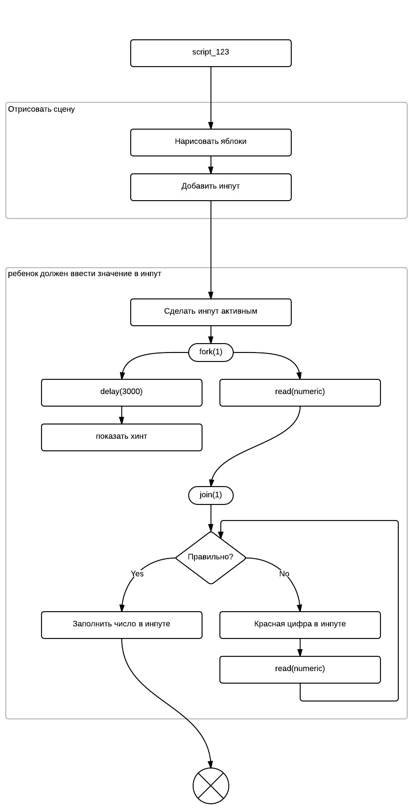

# Процессы разработки контента

Целью этого документа является подготовка новых стандартов разработки контента в
компании Учи.ру. Назрели большие проблемы, которые состоят в том, что
контент разрабатывается долго, в процессе не понятен статус единицы контента и сложно
планировать время релиза следующей порции контента. Это происходит из-за того, что
каждая карточка - это сложная самостоятельная программа
на 400-1000 строчек кода, при разработки который задействуется большой стек технологий, включая
в себя Javascript, CSS, особенности браузеров, наши системные библиотеки и соглашения, компоненты
и так далее. Code style и подходы, заложенные больше года назад не справляются сегодня. Поэтому
вводятся новые концепции создания контента, которые являются логичным розвитием сложившийся
схемы.

Для разработки атомарной единицей контента является скрипт, поэтому данное руководство относится к разработке единичного скрипта. Разработка каждого нового скрипта следует по следующим правилам (далее по тексту будут соответсвующие разъяснения):

1. Создание блок-схемы скрипта на языке UchiGraph. Важно, что блок-схема создается целиком до написания кода.
2. Подготовка нужных спрайтов копи-пастой или создание новых.
3. Имплементация всех необходимых микро-шагов.
4. Использование небольших частых комитов, каждый из которых делает скрипт чуть ближе к финальной точке.

Эти шаги и их порядок необходимо соблюдать. Таким образом комплексная задача по созданию скрипта формализуется и визуализируется прогресс.

*Эмпирическое правило:* каждые 2 часа должен быть хотя бы один комит, который добавляет новые шаги блок-схемы, новый спрайт или реализуется новый микро-шаг выполнения.


## UchiGraph

За логику скрипта отвечает программа на языке описания UchiGraph. Основная идея состоит в том, что любой сценарий можно реализовать с помощью небольших шагов с ветвлениями-условиями и форками (когда несколько шагов выполняется одновременно). Примерами шагов являются элементы сценария, такие как "птица перелетела в гнездо", "отрисовать автобус", "пользователь перетаскивает апельсинки", "показать хинт 'попробуй еще раз'" и так далее.

Базовыми элементами языка являются шаги и связи. Программа на UchiGraph состоит из инструкций, разделенных точкой с запятой `;`. Точка с запятой - обязательные. Шаг записывается в виде уникального имени шага (английские буквы, подчеркивания, цифры) в круглых скобках, и можно указать еще человекопонятное описание после двоеточия. Например `(step1)` или `(step1:лопнуть шарик)`.
Человеко понятное описание достаточно указать один раз. Дальше на шаг нужно ссылаться просто
по имени.

Связи бывают 2-х видов: условные и безусловные. Безусловная связь означает, что после выполнения
шага `a` нужно выполнить шаг `b`, записывается с помощью ANSI-стрелочки `(a)-->(b)`.
Условная связь помечена меткой для организации ветвлений. Переход будет по той связи, метку которой
вернет предыдущий шаг. Метка на связи ставится с помощью квадратных скобок в середине
стрелочки `(a)-[label]->b`. Например в программе `(step)-[yes]->(a);(step)-[no]->(b);` если шаг
`step` вернет `yes`, то следующим выполнится шаг `a`, если вернет `no` - то `b`. Метки нужно делать
короткими английскими словами, в большинстве случаем это будут `yes/no`.

Связь можно пометить как ту, которая вызывает ошибку (откат бусины). Для этого к метке добавляется
постфикс `:err`. Примеры связей при прохождении по которым будет откат бусины: `(a)->[:err]->(b)` или
`(a)-[no:err]->(b)`. Таким образом вызывать `@tutor.wrong` на прямую больше не нужно. Также не нужно
вызывать `@tutor.event` так как все шаги логируются автоматически, соответсвенно SBS строится
автоматически.

Если реализации разных шагов совпадают, это можно пометить с помощью инструкции `1=2;`, которая означает, что
имплементация шага `2` такая же как и `1`. Я не знаю как будет работать эта фича, если попробовать так
прировнять шаги из разных неймспейсов. Возможно эта фича будет убрана/доработана в следующих версиях графа.

Каждый шаг может быть декомпозирован на подшаги. Синтаксически это выглядит следующим образом:

```
(step1:отрисовка сцены)-->(step2);

step1 = {
  (1:добавить кота)-->
  (2:добавить орех)-->
  (3:отрисовать дерево)-->
  next();
};
```

То есть шаг `step1` на самом деле представляет из себя программу на UchiGraph, которая должна
заканчиваться вызовом системной функции `next()`. Подпрограмма в фигурных скобочка лежит как бы в неймспейсе `step1`, поэтому запись выше эквивалентна записи:

```
(step1:отрисовка сцены)-->(step2);

(step1.1:добавить кота)-->(step1.2:добавить орех);

step1 = {
  (3:отрисовать дерево)-->
  next();
};
```

Полное имя шага складывается из всех вложенных неймспейсов. Но лучше придерживаться первой записи,
она более читаемая.

Программа заканчивается вызовом системной функции `the_end()`, которая на самом деле просто вызывает
`@tutor.the_end()`.

Таким образом программа на языке UchiGraph представляет из себя граф верхнего уровня, понятный
педагам, в которой каждый шаг детализируется до нужной степени с помощью необходимого числа подграфов.


### Параллельность

Для работы с паралельными шагами в UchiGraph есть 3 функции: `fork/join/wait`. `fork(n)` полностью клонирует состояние скрипта
(все @-переменные), где n - произвольное уникальное число, идентификатор форка. Форки могут быть вложенными, можно
вызывать `fork` столько раз сколько нужно, каждый раз производя клонированное состояние. `join(n)` заканчивает
все разветвления, созданные `fork(n)` принудительно (это будет объяснено ниже более подробно). `wait(n)` - ждет окончания
всех ветвей. В `wait` можно передать несколько аргументов, `wait(1, 2)` будет ждать окончания всех параллельных шагов,
порожденных `fork(1)` и `fork(2)`.

Дополнительно есть так называемые легкие форки. Если из одного узла мы выпустим несколько безусловных связей, то в этой
точке состояние клонируется и пойдет по всем связям одновременно. Единственное отличие легких форков состоит в том, что их нельзя
перехватить с помощью функций `join` и `wait`.

Важно! В шаге нельзя делать ничего после вызова колбека `cb`. Если нужны легкие отклонения от сценария (допустим что-нибудь
анимировать), то нужно делать легкие форки.


### Системные вызовы

Часть узлов может быть представлена системными вызовами. Это тоже микрошаги, отличие лишь, что имплементировать их не нужно.

`delay(n)` - пауза на n миллисекунд. Например `delay(3000)` - задержка в 3 секунды.

`read(...)` - метод ожидания нажатия на клавиатуру. Аргументы - типы нажатий, которые слушаем, совпадают с аналогичным
параметров в методе `@tutor.keypad_start`. Метод устанавливает переменную `@char` с нажатой клавишей.
Например `read(numeric)` - ожидает нажатия цифры.

`click(...)` - ожидает клика на объект/объекты. Объекты должны быть jquery-объектами или массивами jquery-объектов с уникальными
html-атрибутами id. Метод устанавливает переменную @obj с объектом, на котором произошел клик.

Клик автоматически устанавлиет курсов в указатель над всеми объектами и вешает класс `clickable`. Поэтому если мы хотите добавить
например ховер, достаточно сделать так:

``` scss
.sprite {
  &.clickable:hover {
    background-color: yellow;
  }
}
```

`click_or_enter(obj)` - ожидает клика на объект или нажатии на ентер (использовать для кнопки OK).

`drag/drag_x/drag_y(...)` - драг на объекты. Параметры - jQuery-объекты или массивы jquery-объектов c уникальными html-аттрибутами id.
Чтобы драг заработал, необходимо реализовать в скрипте метод `<полное имя шага>_on_move`, который будет возвращать объект с
обязательным ключом `slot`. Возможны 2 вида ключа `slot` - число или jQuery объект. Драг устанавливает переменные `@obj` и `@slot`.
Чтобы дотянуть объект до слота нужно сделать шаг вручную.

Дополнительно для хитрых драгов можно определить колбеки `<полное имя шага>_on_start` и `<полное имя шага>_on_stop`, которые будут
вызываться, когда объект начали тащить и когда закончили.


### Пример программы на языке UchiGraph

Допустим у нас скрит с #123, на сцене нарисовано 5 яблок, появляется активный инпут. Если ребенок
думает больше 3 секунд, ему нужно показать хинт с подсказкой.

```
# script_123 - точка входа для скрипта c id 123
(script_123)-->
(step1:отрисовать сцену)-->
(step2:ребенок должен ввести значение в инпут)-->
the_end();

step1 = {
  (1:нарисовать яблоки)-->
  (2:добавить инпут)-->
  next();
};

step2 = {
  (1:сделать инпут активным)-->
  fork(1);

  fork(1)-->
  delay(3000)-->
  (2:показать хинт);

  fork(1)-->
  read(numeric)-->
  join(1)-->
  (case:правильно?);

  (case)-[yes]->
  (3:заполнить число в инпуте)-->
  next();

  (case)-[no]->
  (4:красная цифра в инпуте)-->
  read(numeric)-->
  (case);
};
```

Код на UchiGraph довольно сложно разбирать в голове, так как это все таки запись двумерного
графа в плейн-тексте. Поэтому важно придерживаться полностью стиля как в этой программе.
На бумажке очень легко представить, что в данном коде происходит (в будущем мы добавим
визуализацию). Вот например блок-схема для этой программы:



Итак, программа запускается, находится точка входа `script_123`, далее переходим
к первому шагу "отрисовка сцены". Этот шаг на самом деле представляет из себя подпрограмму, которая
рисует последовательно яблоки и инпут. Далее переходим к шагу 2. Сначала инпут
становится активным, потом вызывается форк и одновременно начинается
прослушка клавиатуры `read(numeric)` и пауза на 3 секунды. Если пользователь нажмет на клавишу
до окончания паузы, то на шаге `join(1)` пауза снимется и хинт не появится. Далее, когда
получено нажатие клавиатуры, шаг `(case)` проверяет правильно ли введена цифра и в зависимости
от этого происход переход по связи с меткой `yes` или `no`. В случае `no` продолжается прослушка
клавиатуры и проверка условия до тех пор пока не будет введено правильное число.

Таким образом `input_answer_wait` в данном случае реализован на атомарном уровне, причем
учтен хитрый кейс, который сложно запрограммировать честно, что хинт появляется только,
если пользователь долго думает. UchiGraph
в будущем будет расширен, чтобы можно было включать куски графов и создавать 
компоненты на блок-схемах.


## Спрайты

Следующий слой формализации заглючается в выделении понятия спрайта. Мы принимаем за аксиому, что каждый элемент на сцене - это спрайт, который может хранить в себе другие спрайты, перемещаться на сцене, удалятся и так далее. В большинстве случаев спрайт позиционируется абсолютно, кроме базовых спрайтов, которые размечают сцену.

Технически спрайт сегодня - это просто jquery-объект, желательно с уникальным атрибутом `id`.

Стили для каждого спрайта кладутся тоже в отдельные файл, для спрайта нельзя указывать смещения
`left`, `top` и другие, все позиционирование происходит в коде.

Спрайты должны быть максимально простыми, но не слишком. В идеале они должны с легкостью копипастится
и реиспользоваться в других скриптах.


## Имплементация микрошагов

Каждый шаг из блок-схемы должен быть реализован в виде СoffeeScript-кода. Когда мы подключаем
файл с расширением `.graph` в мету скрипта, то система понимает, что нужно работать по 
блок-схеме и в этом случае писать метод `run` и `SBS` - не нужно. Далее каждый шаг из блок-схемы
можно имплементировать следующим образом. Допустим имя шага `step1.2.3b`, тогда прописав в
классе `$$.Script123` метод `step1__2__3b` как показано ниже вы имплементируете данный шаг:

``` coffee
class $$.Script123
  step1__2__3b: (cb) ->
    # сделать все что нужно
    cb() # <-- вызвать колбек когда сделали все что нужно
```

У каждого шага один параметр - колбек, который нужно вызвать после того как работа шага закончена.
Если шаг подразумевает ветвление, то в колбек можно передать метку условной связи, по которой
следует пройти дальше:

``` coffee
class $$.Script123
  # кот продолжает ехать сам, инпут продолжает заполняется сам?
  case1: (cb) ->
    if @currentStop < @salt.counting - 1
      cb('yes')
    else
      cb('no')
```

Если реализовать метод `<step-name>_on_term`, то этот метод будет вызван, если шаг находится в ветке
форка и другая ветка вызвала `join`. Для системных методов `delay` и `read` on_term-методы
реализованы автоматически.

Возьмем пример с форком, когда нужно скрыть хинт только в том случае если он появился:

```
(step1:сделать инпут активным)-->
fork(1);

fork(1)-->
delay(3000)-->
(step2:показать хинт);

fork(1)-->
read(numeric)-->
join(1)-->
```

``` coffee
class $$.Script123
  step2: (cb) ->
    @white_hint.show()
  step2_on_term: (cb) ->
    @white_hint.hide()
```

Если пользователь нажмет кнопку быстрее чем за 3 секунды, то будет отменен системный
шаг `delay` и `step2` просто не будет вызван. Если он нажмет на кнопку после 3 секунд (обратите
внимание, что шаг 2 выполняется бесконечно, так как он не вызывает колбек), то при нажатии на
кнопку системный шаг `join(1)` вызовет `step2_on_term`, который скроет хинт. С помощью такого
трюка мы удалим белый хинт при первом нажатии, только если этот хинт есть.

Передавать параметры по связям нельзя, так как в случае микрошагов пришлось бы пробрасывать их
слишком далеко, вместо этого следует использовать внутренние переменные через `@`. Эти переменные
формируют текущее состояние скрипта. Чтобы не происходило черезмерного загрязнение внутренностей
экземпляра класса скрипта применяется следующие правила области видимости: `@some` доступна
только внутри поддерева, в которой она была создана. При выходе из этого поддерева переменная
удаляется. Пробросить переменную на уровень выше можно с помощью аргументов метода `next` 
в UchiGraph.

Например, вы строите сцену с помощью следующего кода:

```
(step1:сцена)-->
(step2:работа со сценой);

step1 = {
  (a:нарисовать кота)-->
  (b:нарисовать яблоко)-->
  next();
};
```

В шаге `step1.a` вы сделали спрайт кота, который сохранили в переменной `@cat`. Однако при выходе
из шага step1, переменная `@cat` обнулится во время выполнения `next()` и вы не сможете ей
воспользоваться в шаге 2. Чтобы этого не произошло, необходимо передать агрументы в метод `next`, перечислив
те переменные, которые должны быть доступны на более высоком уровне:

```
(step1:сцена)-->
(step2:работа со сценой);

step1 = {
  (a:нарисовать кота)-->
  (b:нарисовать яблоко)-->
  next(cat, apple);
};
```

Теперь переменные `@cat` и `@apple` будут доступны в шаге 2.


### Соглашения

При оформлении кода придерживаемся следующих соглашений:

* Микрошаги делаем действительно микро. В большинстве случаев они должны состоять из пары строчек.
* Не используем для логики или оформления HTML id атрибуты, они нужды для системных нужд.
* В реализации работы у нас есть 4 фунтдаментальных длительных действия: нажатие кнопки на клавиаутуре, клик, драг и анимация. Для работы с этими действиями необходимо использовать только системные методы UchiGraph - read, click, drag и jquery animate. Запрещается самостоятельно вешать иные любого рода обработчики на элементы дом дерева.


## Заключение

Приведенная система с первого взгляда, да и со второго, может показаться слишком сложной, однако
это не так. Через неделю, я даже без всякой дополнительной визуализации с легкостью менял
дерево и чувствовал себя прекрасно.

Для идеи синтаксиса языка UchiGraph взят язык запросов к базе Neo4j -
[Cypher](http://en.wikipedia.org/wiki/Cypher_Query_Language).
Интерпретатор языка разработан с помощью гема [Parslet](http://kschiess.github.io/parslet/)
