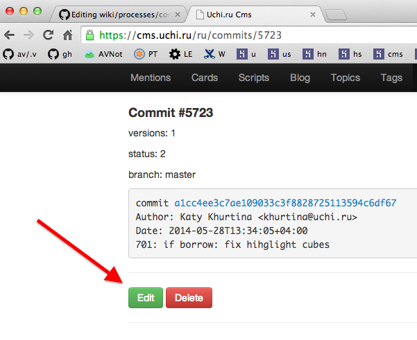
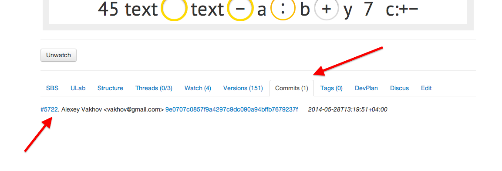
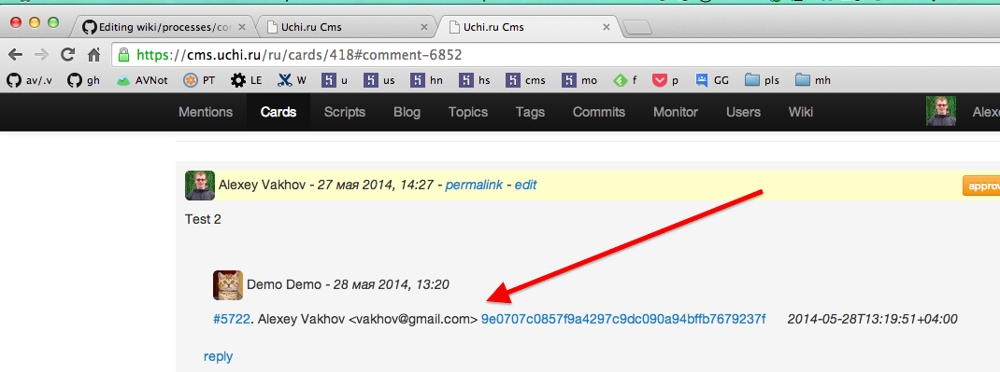

# Правила офорления контент-комитов

В каждом комит-сообщении необходимо указать ID треда, который исправляется данным комитом
или ID карточки (например при начальной разработки карточки).

Поддерживаются несколько форматов, можно использовать любой (для тредов мне кажется будет удобно копировать его пермалинк):

* с#123
* card#123
* ../cards/420
* t#3403
* thread#3403
* ../cards/420#comment-3403

Лучше избегать делать комиты, которые исправляют сразу же много тредов или много карточек. Если это все-таки нужно, то указывайте первый тред или первую карточку, которые данный комит исправляет. Прикреплять несколько комитов к треду/карточке разумеется можно.

Также при работе с репозитарием следует всегда использовать команду `git pull --rebase` вместо обычного `git pull`, чтобы дерево комитов было линейным.

Комиты должны быть по возможности компактными, каждый из которых решают одну задачу.

## Поддержка в ЦМС

Если вы в комите указали ссылку на карточку или тред, то она становится активной, как показано на рисунке ниже

также этот комит появляется на вкладке Commits на странице карточки

или в дереве тредов

Если вы забыли указать в комит-сообщении к какой карточке или треду этот комит идет, то откройте страницу комита в ЦМС и поправьте сообщение вручную

